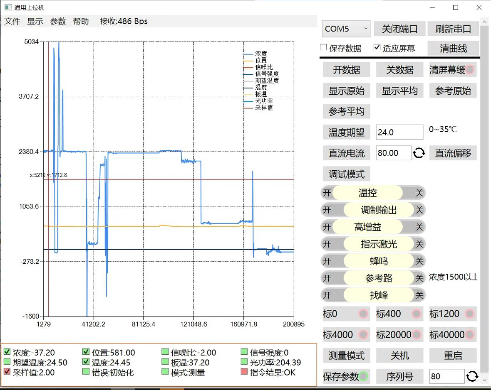
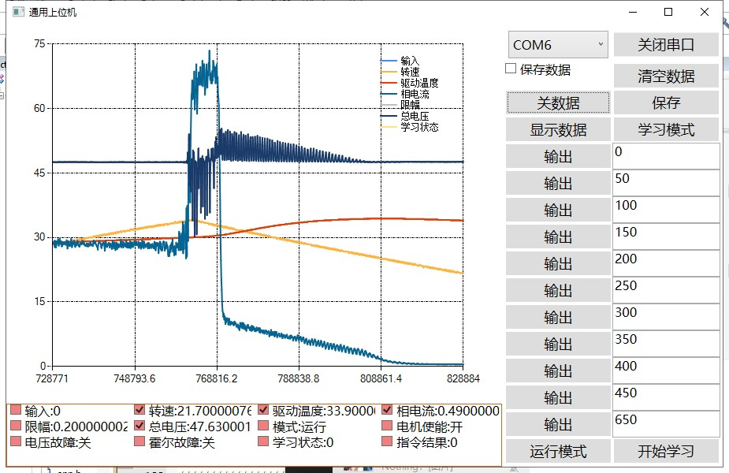
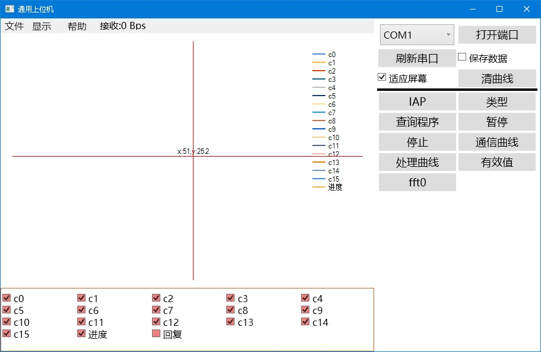

通用测控上位机
======
项目地址：https://github.com/yangzigy/com_mc  
bug反馈：yangzigy@sina.com  
# 功能  
嵌入式设备开发调试过程中，需要使用上位机查看设备状态，下达指令。使用曲线实现状态可视化，记录数据事后分析等功能能够大大提高开发调试效率。  
而不同的嵌入式设备，不同的项目，需要上位机控制的量完全不同，导致基本上每块电路都需要自己的上位机，这个工作量是难以承担的。  
所以需要一款通用上位机，能够尽可能广泛的适应各种项目，各种设备的调试工作。  
通过文本行方式对设备进行测控，包括状态上报和指令下达。状态变量和指令都通过配置文件描述，所以上位机可以在各项目间通用。  
上位机实现曲线显示、变量显示、变量有效性显示、指令下达、数据记录等功能  
  
  
  
## 测控设计原则  
基本仪表测控分为状态上报(上行)和指令下达(下行)两部分,数据类型包括：  
1. 块数据：一段非数值数据，例如地图  
	若需要分包发送，则需要包序号和校验保证完整性。若信道指令不好，还需进行确认反馈  
2. 数值型数据  
	包括数字、字符串，一般多个数值型数据打包发送，当带宽足够时，也可单独发送  
3. 开关量数据  
	一般使用位段压缩在几个字节以内，作为一个数值型变量发送  
4. 事件
	一般通过独立包发送，触发发送。  
对于下行指令，在一个数据组织(数据包)中的不同变量都作为指令执行，除非单主机完全控制，否则影响指令的灵活性，例如，一次操作仅希望影响一个变量，则数据包中的其他变量也都不可避免的被修改了。  
对于具有多个控制端，或一些控制变量涉及自动/人工切换时，需要单独控制的下行指令，需要分小包下发，每个包仅容纳一个控制变量。对于开关型数据，可采用mask方式指定一组有效的变量。  
## 测控UI需求  
1. 传感数值型：显示名称、数值、最近是否收到过数据、选择是否显示曲线  
2. 控制数值型：显示名称、期望值、结果是否成功  
3. 控制指令：显示名称、结果是否成功  
4. 开关型：显示名称、状态、最近是否收到过数据，无论当前状态是开还是关，都可以下达开和关的指令（即使在开的状态也可以下达开的指令）  
5. 参数型：显示名称、期望、当前值、最近是否收到过数据  
## 曲线需求  
1. 上位机需要为多个传感值显示曲线，每个曲线可实时选择显示、隐藏  
2. 曲线具有统一的纵坐标，横坐标可以使用次数和时间两种  
3. 曲线可按一定长度循环显示，可长期实时显示  
4. 曲线可保存、加载历史曲线  
5. 曲线显示界面可使用鼠标左键拖动框选一定的区域放大显示  
6. 曲线显示界面可使用鼠标滚轮实现缩放  
7. 曲线显示界面可使用鼠标右键拖动平移  
## 数据源  
上位机的数据源可以是串口、网络、日志回放等方式，以相同的方法实现数据输入、输出。  
上位机选择数据源，实现“打开”“关闭”操作，以方便的实现对端口的占用和释放  
数据源端口的配置应在配置文件中，以免对UI造成不必要的需求  
# 程序结构  
上位机由C# wpf开发，C#部分使用通用文本测控协议，对状态变量和指令进行描述和交互；使用协议适配器对设备实际协议进行适配。协议适配器为动态库，以cdecl方式调用。  
上位机加载适配器后，将串口数据以流的方式发送给适配器，适配器通过返回标志指示是否提取到了有效数据包，通过全局变量传递结果字符，以通用文本测控协议实现交互。  
## 文件组织  
com_mc: C# wpf代码  
	com_mc.cs：		传感对象和指令对象的实现，界面无关  
	com_mc_gui.cs：	控制控件的实现，与主程序无关  
	state_dis：		测控逻辑的适配，初始化曲线和状态的显示、初始化控制控件  
	DataSrc：		数据源，串口、udp  
obj： 存放编译中间文件  
out： 存放输出文件  
out/config.txt ： 程序的配置文件，在运行时定义通用上位机的界面和协议  
out/com_mc.exe : 生成的可执行文件  
out/*.dll : 程序依赖的动态库  
src： 示例插件代码  
makefile： 示例插件代码的makefile  
## ui  
界面曲线显示区、传感值显示区、基础控制区和配置控制区  
## 传感量  
传感量的显示包括值和刷新两部分，对于每个传感量，通过配置描述，指明其协议，以及解析方法  
传感量通过一个checkbox显示，粉色代表无刷新，绿色有刷新，打勾为显示曲线  
## 控制控件  
根据不同的控制变量，可以设置不同的控制按钮形式，以控件的方式实现配置，支持的控制控件包括：  
1. bt: 按键，单击发送指令，可配置引用文本框或参数编辑框作为指令的参数  
1. text: 文本框，为用户提供输入区域  
1. sw: 开关，可实现下发“开”“关”指令，同时显示当前传感量的状态是开是关  
1. rpl_bool: 带回复的指令，单击下发指令，在1s内收到回复，则高亮表示有反应。颜色表示回复的正确性  
1. label: 文本控件，可显示一个固定字符，或者空白，为布局填充  
1. para: 参数编辑框，带有刷新标志，点击刷新标志下发刷新指令，1s内回复，则刷新标志变绿  
# 协议  
## 通用数据协议  
使用类nmea协议的形式，作为上位机的标准协议，其他协议使用适配器来适配，例如，下位机使用二进制协议时，上位机通过适配器将文本协议转换为二进制协议与下位机交互。  
所以对于上位机来说，协议为类nmea的文本协议，用于对测量变量、指令按钮进行配置  
协议规定，使用行（\n）作为数据包的分割，对于指令，使用空格或tab作为参数的分割符。对于测量变量，使用空格、逗号、tab作为分隔符，行首第一列可以作为普通数据，也可作为协议标志，以$开头，接协议名称。  
规定：  
指令配置时，可通过写入\n来做多个指令
$开头的是与插件或下位机约定的文本协议  
^开头的是软件自身控制协议：  
	^clear         清除当前数据  
	^x_axis 总电压 x轴的索引，只有收到此变量后才增加曲线x轴坐标，若为空，则使用时间ms数作为x轴  
## 测量变量配置协议  
变量名称要求没有空格,可配置的域包括：  
1. name:显示名称(唯一)  
1. type:数据类型:t_val, t_str,值或字符  
1. prot_name:协议名,约定的协议均以$开头  
1. prot_l:协议列数  
1. prot_off:协议中的位置(偏移)  
1. src_type:源数据的类型:src_double,src_float, src_str, src_hex, src_int  
1. pro_method:处理方法:pro_val, pro_bit,线性处理、按位处理  
1. pro_bit:处理bit的位数(起始)  
1. end_bit:处理bit的位数（终止,包含）  
1. pro_k:处理变换kx+b  
1. pro_b:处理变换kx+b  
1. str_tab:显示字符串表  
1. is_cv:是否显示曲线  
1. point_n:若是浮点数，保留的小数位数  
1. is_dis:是否显示，若是按钮的从属，则可以不显示  
## 指令配置协议  
指令名称要求没有空格,可配置的域包括：  
1. name:命令显示名称(唯一)  
1. refdname:关联的数据名称  
1. suffixname:后缀参数名称  
1. cmd:命令名称  
1. cmdoff:关闭指令  
1. c_span:列跨度  
1. type:命令名称  
1. dft:默认值  
# 说明与案例  
## 最简应用  
## 开关、指令、参数控件  
## 菜单参数、数据变换  
## udp数据曲线分析  
配置网络端口：  
```  
"socket":
{
	"ip":"127.0.0.1",
	"port":"54321",
	"type":"udp",
	"rmt_ip":"127.0.0.1",
	"rmt_port":"54322"
},
```  
## 传感数据  
默认源类型：df  
默认数据类型：val  
默认处理类型：pro_val
协议名不写为""，仅通过列数区分  
```  
{"name":"浓度","prot_l":9,"prot_off":0, "is_cv":"true"},
{"name":"温度","prot_l":9,"prot_off":5,"point_n":3, "is_cv":"true"},
//在配置文件中可通过//进行注释
//显示类型为字符，源类型为hex，处理方法为按位处理，从11到第13位（共3位）
//给出显示字符表
{ "name":"错误","dtype":"str","prot_l":9,"prot_off":8,
	"stype":"hex","pro_method":"pro_bit","pro_bit":11,"end_bit":13,
	"str_tab":["正确","初始化","拟合错误","峰位错误","信噪比","跳过处理","强度低"]},
//字符型，不显示。从hex中获取，按bit处理，不写end_bit，只处理一个bit
{ "name":"参考路","dtype":"str","prot_l":9,"prot_off":8,"is_dis":"false",
	"stype":"hex","pro_method":"pro_bit","pro_bit":14},
//对于指令的回复，可统一一种回复方法
//以$r为协议名，共两列，例如： $r,OK
//字符显示，字符为err或OK
{ "name":"指令结果","dtype":"str","prot_name":"$r","prot_l":2,"prot_off":1,
	"stype":"str","str_tab":["err","OK"]},
```  
## 指令  
```  
//普通按键
{"name":"关数据","cmd":"s 0","type":"bt"},
//带软件指令，以^开头。指令可用\n分割，一次发送多条
{"name":"开数据","cmd":"s 1\n^x_axis","type":"bt"},
//带回复的按钮，按下后1s内收到回复，按钮会亮一下表示有反应
//refdname表示引用变量作为回复内容
//按钮的颜色表示回复是否正确，要求是字符型，等于显示字符的第二个字符串（bool型的1）为正确
{"name":"清屏幕缓存","refdname":"指令结果","cmd":"cl_rec","type":"rpl_bool"},
//显示数据前清空数据，给曲线数据指定x轴刷新条件，若没有条件则按ms数去做x轴
{"name":"显示原始","cmd":"oa 1\ns 0\n^clear\n^x_axis 采样值","type":"bt"},
//占位用，也可以写字，注意name为唯一字符
{"name":"","type":"label"},
//带文本框的按钮，分为两部分，按钮使用suffixname来引用文本框。一个文本框可被多个按钮引用
{"name":"温度期望","cmd":"st","type":"bt","suffixname":"tb_exp_T"},
{"name":"tb_exp_T","type":"text","dft":"25"},
//开关型控件，可下达“开”“关”指令，同时显示开关状态，以及刷新状态
//通过引用传感变量的方式获得开关状态和刷新状态，传感变量可设置不显示
//使用cmdoff设置关闭的指令,使用c_span指明此控件占用的空间
{"name":"温控","refdname":"温控","dft":"开",
	"cmd":"outc 1","cmdoff":"outc 0","type":"sw","c_span":2},
//参数的测控，以内存访问指令@进行，文本框使用para类型，以cmd指明刷新指令，以refdname指明参考的传感变量
{"name":"i_off","cmd":"@ 1,1,0,16,","type":"bt","suffixname":"tb_i_off"},
{"name":"tb_i_off","type":"para","dft":"100","cmd":"@ 0,1,0,16,0","refdname":"i_off"}
其中，传感变量的定义：
{"name":"i_off","prot_l":2,"prot_name":"$@:3:1:0:16","prot_off":1,"pro_k":0.1,"is_dis":"false"},
```  
## 数据  

